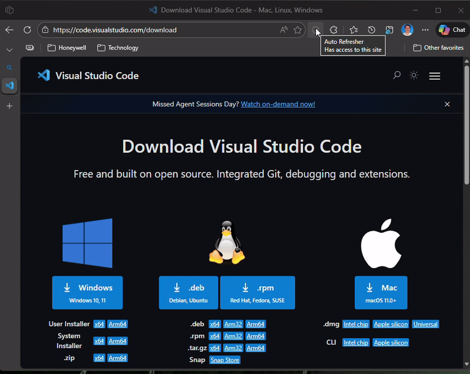

# Auto Refresher

[](https://github.com/karthikveeraj/AutoRefresher/actions/workflows/build.yml)
[](https://github.com/karthikveeraj/AutoRefresher)

A lightweight Chrome/Edge browser extension that auto-refreshes the active tab at a configurable interval. Built with Manifest V3 and TypeScript, with zero runtime dependencies.

## Demo

<!-- Replace with your recorded GIF -->


## Features

- **Configurable intervals** — seconds, minutes, hours, or days
- **Per-tab control** — each tab runs its own independent refresh timer
- **Persistent state** — closing and reopening the popup retains the current config
- **Active/inactive icons** — visual indicator on the toolbar icon when a tab is refreshing
- **Auto-cleanup** — closing a tab automatically removes its timer and stored config
- **Input validation** — enforces minimum 1-second and maximum 7-day intervals
- **Privacy-first** — no data collection, no network calls, no remote code

## Documentation

For detailed architecture, implementation plan, security considerations, and testing strategy, see the [Architecture Overview](docs/architecture-overview.md).

## Installation

### From Chrome Web Store / Edge Add-ons

> Coming soon

### From source (Developer mode)

1. Clone the repository:
   ```bash
   git clone https://github.com/karthikveeraj/AutoRefresher.git
   cd AutoRefresher
   ```

2. Install dependencies and build:
   ```bash
   npm install
   npm run build
   ```

3. Load in your browser:
   - **Chrome**: Go to `chrome://extensions/` → enable **Developer mode** → click **Load unpacked** → select the `dist/` folder
   - **Edge**: Go to `edge://extensions/` → enable **Developer mode** → click **Load unpacked** → select the `dist/` folder

## Usage

1. Click the **Auto Refresher** icon in the toolbar
2. Set the refresh interval (e.g., `30`) and time unit (e.g., `Seconds`)
3. Click **Start** — the page will auto-refresh at the specified interval
4. Click **Stop** to cancel


## Development

### Prerequisites

- Node.js 18+
- Chrome 88+ or Edge 88+

### Commands

| Command | Description |
|---------|-------------|
| `npm install` | Install dependencies |
| `npm run build` | Clean build — compile TypeScript and copy assets to `dist/` |
| `npm run watch` | Watch mode — recompile on file changes |
| `npm run clean` | Delete the `dist/` folder |
| `npm test` | Run tests |
| `npm run test:watch` | Run tests in watch mode |

### Project Structure

```
AutoRefresher/
├── src/
│   ├── background.ts       # Service worker — timer & tab management
│   ├── popup.ts             # Popup UI logic
│   ├── popup.html           # Popup markup
│   ├── popup.css            # Popup styles
│   └── types.ts             # Shared TypeScript types
├── icons/                   # Extension icons (16/48/128px, active & inactive)
├── tests/                   # Jest tests
├── scripts/                 # Build helper scripts
├── manifest.json            # Extension manifest (Manifest V3)
├── tsconfig.json            # TypeScript config
├── jest.config.js           # Jest config
└── dist/                    # Build output (git-ignored)
```

## How It Works

- **Intervals ≥ 60s** use `chrome.alarms` API — reliable and survives service worker restarts
- **Intervals < 60s** also use `chrome.alarms` — works at any frequency for unpacked/dev extensions
- Config is stored per-tab in `chrome.storage.local`
- On tab close, `chrome.tabs.onRemoved` cleans up the alarm and storage entry

## Permissions

| Permission | Why |
|------------|-----|
| `alarms` | Schedule periodic refresh timers |
| `storage` | Persist per-tab refresh config |
| `activeTab` | Access the current tab to reload |
| `tabs` | Detect tab close for cleanup |

No content scripts, no `<all_urls>`, no network access.

## License

[MIT](LICENSE)
