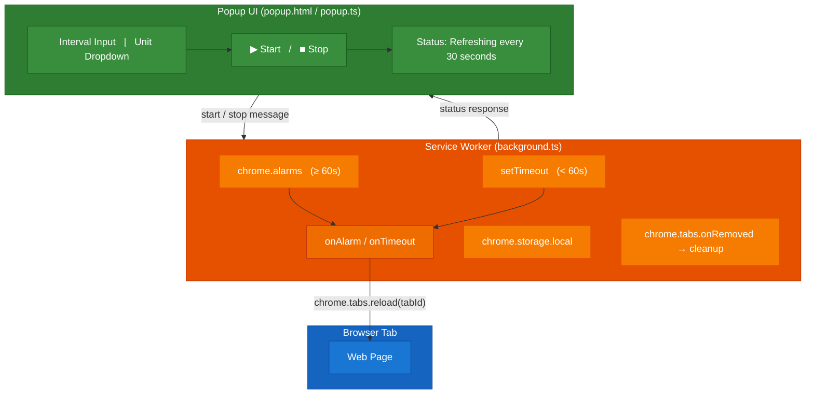

# Auto Refresher — Chrome/Edge Browser Extension

## Repository Description

A lightweight Chrome/Edge browser extension that auto-refreshes the active tab at a configurable interval (seconds, minutes, hours, or days). Manifest V3, zero dependencies, built with TypeScript.

## 1. Requirements

### 1.1 Overview
Build a browser extension for Chrome and Microsoft Edge that automatically refreshes the active tab's web page at a user-configured interval.

### 1.2 Functional Requirements
| ID | Requirement |
|----|-------------|
| FR-01 | User can set a refresh interval as a numeric value (e.g., 5, 10, 30) |
| FR-02 | User can select a time unit: Seconds, Minutes, Hours, or Days |
| FR-03 | User can start auto-refresh for the currently active tab |
| FR-04 | User can stop auto-refresh for the currently active tab |
| FR-05 | The extension shows the current refresh status (active/inactive) in the popup |
| FR-06 | The extension shows a visual badge on the icon for tabs with active refresh |
| FR-07 | Refresh configuration persists per tab — closing and reopening the popup retains state |
| FR-08 | Closing a tab automatically cleans up its refresh timer and stored config |
| FR-09 | Minimum interval enforced: 1 second (to prevent accidental rapid reloading) |

### 1.3 Non-Functional Requirements
| ID | Requirement |
|----|-------------|
| NFR-01 | Uses Manifest V3 (required by Chrome, supported by Edge) |
| NFR-02 | Zero runtime dependencies — no external libraries shipped with the extension |
| NFR-03 | TypeScript for development; compiled to JavaScript for distribution |
| NFR-04 | Lightweight — popup loads instantly, minimal memory footprint |
| NFR-05 | Works on Chrome 88+ and Edge 88+ (Chromium-based) |

---

## 2. Architecture Overview

### 2.1 High-Level Architecture



### 2.2 Component Responsibilities

| Component | File | Responsibility |
|-----------|------|---------------|
| **Manifest** | `manifest.json` | Declares extension metadata, permissions, entry points |
| **Service Worker** | `src/background.ts` | Timer management (alarms + setTimeout), tab reload, cleanup |
| **Popup UI** | `src/popup.html` | User interface — interval input, unit selector, start/stop |
| **Popup Logic** | `src/popup.ts` | Reads/writes storage, sends messages to service worker |
| **Popup Styles** | `src/popup.css` | Visual styling for the popup |

### 2.3 Communication Flow

1. **User opens popup** → `popup.ts` queries the active tab ID → reads config from `chrome.storage.local` → renders current state
2. **User clicks Start** → `popup.ts` validates input → sends `{ action: "start", tabId, interval, unit }` message to service worker
3. **Service Worker receives "start"** → converts interval to milliseconds → creates alarm (≥60s) or starts setTimeout loop (<60s) → saves config to storage → sets badge
4. **Timer fires** → service worker calls `chrome.tabs.reload(tabId)` → reschedules if using setTimeout
5. **User clicks Stop** → `popup.ts` sends `{ action: "stop", tabId }` → service worker clears alarm/timeout → removes badge → updates storage
6. **Tab closed** → `chrome.tabs.onRemoved` listener → clears alarm/timeout → removes storage entry

### 2.4 Timer Strategy

| Interval | Mechanism | Reason |
|----------|-----------|--------|
| < 60 seconds | `setTimeout` loop | `chrome.alarms` enforces 1-minute minimum in production |
| ≥ 60 seconds | `chrome.alarms` API | Reliable, survives service worker restarts |

---

## 3. Solution Folder Structure

```
Refresher/
│
├── src/                        # TypeScript source files
│   ├── background.ts           # Service worker — timer & tab management
│   ├── popup.ts                # Popup UI logic
│   ├── popup.html              # Popup markup
│   ├── popup.css               # Popup styles
│   └── types.ts                # Shared TypeScript interfaces/types
│
├── icons/                      # Extension icons
│   ├── icon16.png              # 16×16 — favicon, toolbar
│   ├── icon48.png              # 48×48 — extensions page
│   └── icon128.png             # 128×128 — Chrome Web Store
│
├── tests/                      # Test files
│   ├── validation.test.ts      # Input validation & time conversion tests
│   ├── background.test.ts      # Service worker logic tests (mocked Chrome APIs)
│   └── setup.ts                # jest-chrome mock setup
│
├── manifest.json               # Extension manifest (Manifest V3)
├── tsconfig.json               # TypeScript compiler configuration
├── package.json                # Dev dependencies & build scripts
├── jest.config.js              # Jest test configuration
├── .gitignore                  # Ignore node_modules, dist
├── requirement.txt             # Original requirements
│
└── dist/                       # Build output (git-ignored)
    ├── background.js           # Compiled service worker
    ├── popup.js                # Compiled popup logic
    ├── popup.html              # Copied from src
    ├── popup.css               # Copied from src
    ├── manifest.json           # Copied from root
    └── icons/                  # Copied from root
        ├── icon16.png
        ├── icon48.png
        └── icon128.png
```

---

## 4. Implementation Plan

### Phase 1: Project Setup
| Step | Task | Details |
|------|------|---------|
| 1.1 | Initialize npm project | `npm init -y` |
| 1.2 | Install dev dependencies | `npm install --save-dev typescript chrome-types jest ts-jest @types/jest jest-chrome` |
| 1.3 | Create `tsconfig.json` | Target: ES2020, Module: ES2020, Strict: true, outDir: dist |
| 1.4 | Create `manifest.json` | Manifest V3 with permissions: alarms, storage, activeTab, tabs |
| 1.5 | Create placeholder icons | Simple 16/48/128px icons |
| 1.6 | Add build scripts to `package.json` | `build`, `watch`, `clean` scripts |
| 1.7 | Create `.gitignore` | Ignore `node_modules/`, `dist/` |

### Phase 2: Shared Types
| Step | Task | Details |
|------|------|---------|
| 2.1 | Create `src/types.ts` | Define `TimeUnit` enum, `RefreshConfig` interface, `Message` types |

### Phase 3: Service Worker (background.ts)
| Step | Task | Details |
|------|------|---------|
| 3.1 | Message listener | Handle "start", "stop", "getStatus" messages from popup |
| 3.2 | Alarm-based refresh | `chrome.alarms.create()` for intervals ≥ 60s |
| 3.3 | setTimeout-based refresh | Interval loop for < 60s with Map to track active timeouts |
| 3.4 | Tab reload | `chrome.tabs.reload()` on alarm/timeout fire |
| 3.5 | Tab close cleanup | `chrome.tabs.onRemoved` → clear timer + storage |
| 3.6 | Badge management | Set/clear badge text on extension icon per tab |
| 3.7 | Startup recovery | `chrome.runtime.onStartup` → re-register alarms from storage |

### Phase 4: Popup UI
| Step | Task | Details |
|------|------|---------|
| 4.1 | Create `popup.html` | Form: numeric input, unit dropdown, start/stop button, status area |
| 4.2 | Create `popup.css` | Clean, modern styling |
| 4.3 | Create `popup.ts` | Query active tab, load config, wire up start/stop, update UI |

### Phase 5: Testing
| Step | Task | Details |
|------|------|---------|
| 5.1 | Set up Jest + ts-jest + jest-chrome | `npm install --save-dev jest ts-jest @types/jest jest-chrome` |
| 5.2 | Create `jest.config.js` and `tests/setup.ts` | Configure ts-jest preset and Chrome API mocks |
| 5.3 | Write validation tests | Test interval validation, time conversion, max interval guard |
| 5.4 | Write background tests | Test message handling, alarm creation, tab reload, cleanup |
| 5.5 | Run tests | `npm test` — all tests pass |

### Phase 6: Build & Manual Test
| Step | Task | Details |
|------|------|---------|
| 6.1 | Build project | `npm run build` |
| 6.2 | Load in browser | Load `dist/` as unpacked extension |
| 6.3 | Manual testing | Walk through integration test checklist (see Section 8.3) |

### Dependency Graph
```
Phase 1 (Setup)
    └── Phase 2 (Types)
            ├── Phase 3 (Service Worker)  ← can be parallel
            └── Phase 4 (Popup UI)        ← can be parallel
                    └── Phase 5 (Testing)
                            └── Phase 6 (Build & Manual Test)
```

---

## 5. Security Considerations

### 5.1 Permissions — Principle of Least Privilege

| Permission | Why Needed | Risk Mitigation |
|------------|-----------|-----------------|
| `alarms` | Schedule periodic refresh | Low risk — only creates timers |
| `storage` | Persist per-tab config | Low risk — local only, no sync |
| `activeTab` | Access the current tab to reload | Scoped to active tab only — no broad tab access |
| `tabs` | Detect tab close, get tab info | Needed for cleanup; does NOT access tab content |

**Not requested (deliberately):**
- `<all_urls>` — we don't inject content scripts or access page content
- `webRequest` — we don't intercept or modify network requests
- `cookies` — we don't access cookies
- `history` — we don't access browsing history

### 5.2 Content Security Policy (CSP)
```json
"content_security_policy": {
  "extension_pages": "script-src 'self'; object-src 'none';"
}
```
- **No inline scripts** — all JS loaded from files
- **No eval()** — never used
- **No remote scripts** — no CDN or external script loading

### 5.3 Input Validation
| Input | Validation |
|-------|-----------|
| Interval value | Must be a positive integer ≥ 1 |
| Time unit | Must be one of the enum values (seconds/minutes/hours/days) |
| Tab ID | Must be a valid numeric tab ID from Chrome API |
| Max interval | Cap at a reasonable maximum (e.g., 7 days) to prevent overflow |

### 5.4 Data Security
- **No user data collection** — the extension collects zero personal data
- **No network calls** — the extension makes no HTTP/fetch requests; it only uses Chrome APIs
- **No remote code execution** — all code is local, no dynamic script loading
- **Local storage only** — config stored in `chrome.storage.local` (device-only, not synced)

### 5.5 Service Worker Security
- No use of `eval()`, `new Function()`, or dynamic code generation
- All message types are strictly typed (TypeScript enforces valid message shapes)
- Invalid messages are ignored with no side effects

### 5.6 OWASP Top 10 Applicability
| OWASP Category | Applicable? | Mitigation |
|---------------|------------|-----------|
| Injection | Minimal — no DB, no DOM injection from external input | Input validated; no innerHTML with user data |
| Broken Access Control | N/A — no authentication/authorization | No user accounts or access levels |
| Cryptographic Failures | N/A — no sensitive data stored | No passwords, tokens, or PII |
| Insecure Design | Low | Follow Chrome extension security best practices |
| Security Misconfiguration | Low | Minimal permissions, strict CSP |
| Vulnerable Components | Low | Zero runtime dependencies |
| SSRF | N/A | No outbound HTTP requests |

---

## 6. How to Build

### 6.1 Prerequisites
- **Node.js** 18+ and npm (https://nodejs.org)
- **Chrome** 88+ or **Edge** 88+
- **Git** (optional, for version control)

### 6.2 Initial Setup (One-Time)
```bash
# Navigate to project directory
cd Refresher

# Install dev dependencies
npm install
```

This installs TypeScript and Chrome API type definitions.

### 6.3 Build Commands

| Command | Purpose |
|---------|---------|
| `npm run build` | Clean build — compile TS and copy static files to `dist/` |
| `npm run watch` | Watch mode — recompile on file changes (development) |
| `npm run clean` | Delete the `dist/` folder |

### 6.4 Build Process Details
1. `tsc` compiles `src/background.ts` and `src/popup.ts` → JavaScript in `dist/`
2. A copy script copies static assets (`manifest.json`, `popup.html`, `popup.css`, `icons/`) into `dist/`
3. The `dist/` folder is a complete, loadable extension

### 6.5 What `tsconfig.json` Does
```
Target: ES2020       — Modern JS output (supported by Chrome 88+)
Module: ES2020       — ES module syntax
Strict: true         — Full type checking
outDir: dist         — Output compiled JS to dist/
rootDir: src         — Source files in src/
```

---

## 7. How to Deploy

### 7.1 Local Development (Unpacked Extension)

**Chrome:**
1. Open `chrome://extensions/`
2. Enable **Developer mode** (toggle in top-right)
3. Click **"Load unpacked"**
4. Select the `dist/` folder
5. The extension icon appears in the toolbar

**Edge:**
1. Open `edge://extensions/`
2. Enable **Developer mode** (toggle in bottom-left)
3. Click **"Load unpacked"**
4. Select the `dist/` folder
5. The extension icon appears in the toolbar

**After code changes:**
1. Run `npm run build` (or use `npm run watch` for auto-rebuild)
2. Go to the extensions page
3. Click the **reload** button on the extension card
4. Changes take effect immediately

### 7.2 Publishing to Chrome Web Store (Production)

| Step | Action |
|------|--------|
| 1 | Create a ZIP of the `dist/` folder contents |
| 2 | Go to [Chrome Web Store Developer Dashboard](https://chrome.google.com/webstore/devconsole) |
| 3 | Pay one-time $5 developer registration fee |
| 4 | Click "New Item" → upload the ZIP |
| 5 | Fill in listing details: description, screenshots, category |
| 6 | Submit for review (typically 1-3 business days) |

**Create the ZIP:**
```bash
cd dist
# On Windows (PowerShell):
Compress-Archive -Path * -DestinationPath ../auto-refresher.zip

# On macOS/Linux:
zip -r ../auto-refresher.zip .
```

### 7.3 Publishing to Edge Add-ons Store (Production)

| Step | Action |
|------|--------|
| 1 | Use the same ZIP file from above |
| 2 | Go to [Edge Partner Center](https://partner.microsoft.com/en-us/dashboard/microsoftedge/overview) |
| 3 | Sign in with a Microsoft account |
| 4 | Click "Create new extension" → upload the ZIP |
| 5 | Fill in listing details |
| 6 | Submit for review |

### 7.4 Version Updates
1. Update the `"version"` field in `manifest.json` (e.g., `"1.0.0"` → `"1.1.0"`)
2. Rebuild: `npm run build`
3. Create a new ZIP of `dist/`
4. Upload to the respective store dashboard
5. Submit for review

---

## 8. Testing Strategy

### 8.1 Unit Tests

Use **Jest** with **ts-jest** to test pure logic in isolation (no browser APIs needed for these).

| Test Area | What to Test |
|-----------|-------------|
| Input validation | Interval must be ≥ 1, rejects 0, negative, non-numeric, floats |
| Time conversion | Seconds/minutes/hours/days → correct milliseconds |
| Max interval guard | Intervals > 7 days are rejected |
| Config serialization | `RefreshConfig` objects serialize/deserialize correctly |

**Setup:**
```bash
npm install --save-dev jest ts-jest @types/jest
```

**Config** (`jest.config.js`):
```js
module.exports = {
  preset: "ts-jest",
  testEnvironment: "node",
  roots: ["<rootDir>/tests"],
};
```

**Run:**
```bash
npm test           # run all tests
npm test -- --watch  # watch mode
```

### 8.2 Chrome API Mocks

Chrome extension APIs (`chrome.alarms`, `chrome.tabs`, `chrome.storage`, `chrome.runtime`) are not available in Node.js. Use manual mocks or a library like **`jest-chrome`**.

```bash
npm install --save-dev jest-chrome
```

| Test Area | What to Test |
|-----------|-------------|
| Start message handling | Receiving `{ action: "start" }` creates an alarm (≥60s) or registers a timeout (<60s) |
| Stop message handling | Receiving `{ action: "stop" }` clears the alarm/timeout and updates storage |
| Alarm fire → tab reload | When `chrome.alarms.onAlarm` fires, `chrome.tabs.reload()` is called with correct tab ID |
| Tab close cleanup | When `chrome.tabs.onRemoved` fires, alarm + storage entry are removed |
| Badge update | Starting sets badge text; stopping clears it |
| Startup recovery | On `chrome.runtime.onStartup`, configs are read from storage and alarms re-registered |
| Invalid messages | Unknown action types are ignored without errors |

### 8.3 Integration / Manual Testing Checklist

Perform these tests by loading the unpacked extension in a browser:

| # | Scenario | Expected Result |
|---|----------|----------------|
| 1 | Set 5 seconds, click Start | Page reloads every ~5 seconds |
| 2 | Set 2 minutes, click Start | Page reloads every 2 minutes |
| 3 | Click Stop while running | Reloading stops immediately |
| 4 | Close and reopen popup while running | Popup shows current active config and "Stop" button |
| 5 | Close the tab while refresh is active | No errors; alarm is cleaned up (check `chrome://extensions` → service worker logs) |
| 6 | Set interval on Tab A, switch to Tab B, set different interval | Both tabs refresh independently at their own intervals |
| 7 | Set 0 or negative interval | Input rejected; Start button disabled or shows validation error |
| 8 | Set interval > 7 days | Input rejected |
| 9 | Restart browser with an active refresh config | Refresh resumes after browser restart (for alarm-based intervals ≥ 60s) |
| 10 | Check badge on active tab | Badge shows interval text (e.g., "30s") while refresh is active |
| 11 | Check badge clears on stop | Badge text removed after clicking Stop |
| 12 | Navigate to a new URL in same tab while refresh is active | Refresh continues on the new URL |
| 13 | Test on Chrome | All scenarios pass |
| 14 | Test on Edge | All scenarios pass |

### 8.4 Test Folder Structure

```
Refresher/
├── tests/
│   ├── validation.test.ts      # Input validation & time conversion
│   ├── background.test.ts      # Service worker message handling (mocked Chrome APIs)
│   └── setup.ts                # jest-chrome mock setup
├── jest.config.js
└── ...
```

### 8.5 CI (Optional)

If using GitHub Actions or similar, add a workflow to run tests on push:

```yaml
# .github/workflows/test.yml
name: Tests
on: [push, pull_request]
jobs:
  test:
    runs-on: ubuntu-latest
    steps:
      - uses: actions/checkout@v4
      - uses: actions/setup-node@v4
        with:
          node-version: 20
      - run: npm ci
      - run: npm test
      - run: npm run build
```

---

## 9. Quick Reference

| Task | Command |
|------|---------|
| Install dependencies | `npm install` |
| Run tests | `npm test` |
| Run tests (watch) | `npm test -- --watch` |
| Build the extension | `npm run build` |
| Watch for changes | `npm run watch` |
| Clean build output | `npm run clean` |
| Load extension | Browser → Extensions → Load unpacked → select `dist/` |
| Reload after changes | Extensions page → click reload on extension card |
| Package for store | ZIP the contents of `dist/` |
